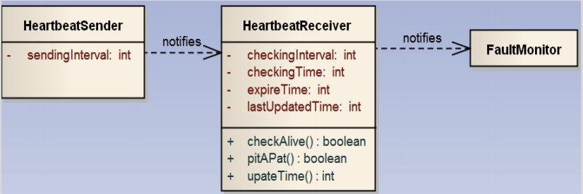

## After requirements...


<!-- .element: class="plain stretch" -->


----
## Learning Goals

* Describe the role of architecture and design between requirements and implementation
* Identify the different ML components and organize and prioritize their quality concerns for a given project
* Explain they key ideas behind decision trees and random forests and analyze consequences for various qualities
* Demonstrate an understanding of the key ideas of deep learning and how it drives qualities
* Plan and execute an evaluation of the qualities of alternative AI components for a given purpose

----
## Readings

Required reading: Hulten, Geoff. "Building Intelligent Systems: A
Guide to Machine Learning Engineering." (2018), Chapters 17 and 18

Recommended reading: Siebert, Julien, Lisa Joeckel, Jens Heidrich, Koji Nakamichi, Kyoko Ohashi, Isao Namba, Rieko Yamamoto, and Mikio Aoyama. “Towards Guidelines for Assessing Qualities of Machine Learning Systems.” In International Conference on the Quality of Information and Communications Technology, pp. 17–31. Springer, Cham, 2020.


---
# Recall: ML is a Component in a System in an Environment


----
<!-- colstart -->

<!-- .element: class="plain" -->

<!-- col -->

* **ML components** for transcription model, pipeline to train the model, monitoring infrastructure...
* **Non-ML components** for data storage, user interface, payment processing, ...
* User requirements and assumptions
* 
* System quality vs model quality
* System requirements vs model requirements
 
<!-- colend -->


----
## Recall: Systems Thinking


<!-- .element: class="plain stretch" -->

> A system is a set of inter-related components that work together in a particular environment to perform whatever functions are required to achieve the system's objective -- Donella Meadows


---
# Thinking like a Software Architect


<!-- .element: class="plain" -->


----
## From Requirements to Implementations...

We know what to build, but how? How to we meet the quality goals?


<!-- .element: class="plain" -->

**Software architecture:** Key design decisions, made early in the
  development, focusing on key product qualities

Architectural decisions are hard to change later


----
## Software Architecture

> The software architecture of a program or computing system is the **structure or structures** of the system, which comprise **software elements**, the ***externally visible properties*** of those elements, and the relationships among them.
> -- [Kazman et al. 2012](https://www.oreilly.com/library/view/software-architecture-in/9780132942799/?ar)


----
## Architecture Decisions: Examples

* What are the major components in the system? What does each
component do? 
* Where do the components live? Monolithic vs microservices?
* How do components communicate to each other? Synchronous vs
asynchronous calls?
* What API does each component publish? Who can access this API?
* Where does the ML inference happen? Client-side or server-side?
* Where is the telemetry data collected from the users stored?
* How large should the user database be? Centralized vs decentralized?
* ...and many others

----
## Software Architecture

> Architecture represents the set of **significant** **design** decisions that shape the form and the function of a system, where **significant** is measured by cost of change.
> -- [Grady Booch, 2006]

----
## How much Architecture/Design?


<!-- .element: class="stretch" -->


Software Engineering Theme: *Think before you code*

Like requirements: Slower initially, but upfront investment can prevent problems later and save overall costs

-> Focus on most important qualities early, but leave flexibility

----
## Quality Requirements Drive Architecture Design

Driven by requirements, identify most important qualities

Examples:
* Development cost, operational cost, time to release
* Scalability, availability, response time, throughput
* Security, safety, usability, fairness
* Ease of modifications and updates
* ML: Accuracy, ability to collect data, training latency

----
## Architecture Design Involves Quality Trade-offs


<!-- .element: class="stretch" -->

**Q. What are quality trade-offs between the two?**

<!-- references_ -->
[Image source](https://medium.com/javanlabs/micro-services-versus-monolithic-architecture-what-are-they-e17ddc8d3910)

----

## Why Architecture? ([Kazman et al. 2012](https://www.oreilly.com/library/view/software-architecture-in/9780132942799/?ar))

<div class="small">

Represents earliest design decisions.

Aids in **communication** with stakeholders: Shows them “how” at a level they can understand, raising questions about whether it meets their needs

Defines **constraints** on implementation: Design decisions form “load-bearing walls” of application

Dictates **organizational structure**: Teams work on different components

Inhibits or enables **quality attributes**: Similar to design patterns

Supports **predicting** cost, quality, and schedule: Typically by predicting information for each component

Aids in software **evolution**: Reason about cost, design, and effect of changes

</div>

----

## Case Study: Twitter

<!-- .element: style="width:800px" -->

Note: Source and additional reading: Raffi. [New Tweets per second record, and how!](https://blog.twitter.com/engineering/en_us/a/2013/new-tweets-per-second-record-and-how.html) Twitter Blog, 2013

----

## Twitter - Caching Architecture


<!-- .element: class="stretch" -->

Notes:

* Running one of the world’s largest Ruby on Rails installations
* 200 engineers
* Monolithic: managing raw database, memcache, rendering the site, and * presenting the public APIs in one codebase
* Increasingly difficult to understand system; organizationally challenging to manage and parallelize engineering teams
* Reached the limit of throughput on our storage systems (MySQL); read and write hot spots throughout our databases
* Throwing machines at the problem; low throughput per machine (CPU + RAM limit, network not saturated)
* Optimization corner: trading off code readability vs performance

----

## Twitter's Redesign Goals

<div class="smallish">

* **Performance**
    * Improve median latency; lower outliers 
    * Reduce number of machines 10x
+ **Reliability**
    * Isolate failures
+ **Maintainability**
    * *"We wanted cleaner boundaries with “related” logic being in one place"*: 
encapsulation and modularity at the systems level (vs class/package level)
* **Modifiability**
    * Quicker release of new features: *"run small and empowered engineering teams that could make local decisions and ship user-facing changes, independent of other teams"*

</div>

<!-- references -->

Raffi. [New Tweets per second record, and how!](https://blog.twitter.com/engineering/en_us/a/2013/new-tweets-per-second-record-and-how.html) Twitter Blog, 2013

----
## Twitter: Redesign Decisions

<!-- colstart -->

* Ruby on Rails -> JVM/Scala 
* Monolith -> Microservices
* RPC framework with monitoring, connection pooling, failover strategies, loadbalancing, ... built in
* New storage solution, temporal clustering, "roughly sortable ids"
* Data driven decision making

<!-- col -->


<!-- .element: class="stretch" -->

<!-- colend -->
----

## Twitter Case Study: Key Insights

Architectural decisions affect entire systems, not only individual modules

Abstract, different abstractions for different scenarios

Reason about quality attributes early

Make architectural decisions explicit

Question: **Did the original architect make poor decisions?**


---
## Codifying Design Knowledge 


<!-- .element: class="stretch" -->

----
## System Decomposition


<!-- .element: class="stretch plain" -->

Identify components and their responsibilities

Establishes interfaces and team boundaries

----
### Common Components in ML-based Systems

* **Model inference service**: Uses model to make predictions for input data
* **ML pipeline**: Infrastructure to train/update the model
* **Monitoring**: Observe model and system
* **Data sources**: Manual/crowdsourcing/logs/telemetry/...
* **Data management**: Storage and processing of data, often at scale
* **Feature store**: Reusable feature engineering code, cached feature computations

----
## Common System-Wide Design Challenges

Separating concerns, understanding interdependencies
* e.g., anticipating/breaking feedback loops, conflicting needs of components

Facilitating experimentation, updates with confidence

Separating training and inference; closing the loop
* e.g., collecting telemetry to learn from user interactions

Learn, serve, and observe at scale or with resource limits
* e.g., cloud deployment, embedded devices


----
## Each system is different...


<!-- .element: class="stretch" -->


----
## Each system is different...

 
<!-- .element: class="stretch" -->

----
## Each system is different...

<!-- .element: style="width:700px" -->

----
## Each system is different...


<!-- .element: style="width:800px" -->


----
## System Decomposition

<div class="smallish">

Each system is different, identify important components


Examples:
* Personalized music recommendations: microservice deployment in cloud, logging of user activity, nightly batch processing for inference, regular model updates, regular experimentation, easy fallback
* Transcription service: irregular user interactions, large model, expensive inference, inference latency not critical, rare model updates
* Autonomous vehicle: on-board hardware sets limits, real-time needs, safety critical, updates necessary, limited experimentation in practice, not always online
* Smart keyboard: privacy focused, small model, federated learning on user device, limited telemetry

</div>


----
## Common System Structures

Designers and architects accumulate tacit and codified knowledge based on their own experience and best practices.

In designing a new system, it is best to start with experience and a design vocabulary, focusing directly on the specific qualities relevant to the tradeoffs.

At the highest level of organizing components, there are common structures shared by many systems, also known as _architectural styles_.

----
## Monolithic system

<!-- .element: style="width:800px" -->

(pre-redesign)

----
## Client-Server Architecture 

<!-- .element: style="width:700px" -->

<div class="small">

* A server provides functionality to multiple clients, typically over a network connection. 
* Resources shared for many users, while clients are fairly simple. 

</div>


----
## Multi-tier architecture

<!-- .element: style="width:800px" -->

Higher tiers send requests to lower tiers, but not vice versa. 

Common for business and web applications.

Notes: can be conceptually extended with components related to machine learning (as we will show in chapter Deploying a Model).

----
## SOA and microservices

<!-- .element: style="width:600px" -->

Multiple self-contained services/processes that communicate via RPC.  

Notes: allows independent deployment, versioning, and scaling of services and flexible routing of requests at the network level. Many modern, scalable web-based systems use this design, as we will discuss in chapter Scaling the System.  Also independent development. 

----
## Event-based architecture


<!-- .element: class="plain stretch" -->

Individual system components listen to messages broadcasted by other components, typically through some message bus.

Notes: Since the component publishing a message does not need to know who consumes it, this architecture strongly decouples components in a system and makes it easy to add new components. We will see this architecture style when discussing stream processing systems in chapter Scaling the System.

----
## Data-flow architectures


<div class="small">

_Dataflow program composed of shell commands._

</div>

The system is organized around data, often in a sequential pipeline. 

Notes: This design allows flexible changes of components and flexible composition of pipelines from different subsets of components. Unix shell commands can be composed through pipes to perform more complex tasks and machine-learning pipelines often follow this design of multiple transformations to a dataset arranged in a sequence or directed acyclic graph. Machine-learning pipelines tend to follow this data-flow style, as do batch processing systems for very large datasets.

----
## Design Patterns

<!-- colstart -->
<!-- .element: style="width:350px" class="stretch" -->

<!-- col -->

Design patterns name and describe common solutions to known design problems, and known advantages and pitfalls. 

Historically popular in OO; now applied broadly across system design, both architecturally and at a lower level (i.e., interactions among subsystems). 

<!-- colend -->
----
## Observer or publish-subscribe

<!-- .element: style="width:800px" -->

<div class="smallish">
Intent: Define a one-to-many dependency between objects so that when one object changes state, all its dependents are notified and updated automatically.
</div>

Notes: 
Motivation: [This would include an illustrative example of a user interface that needs to update multiple visual representations of data whenever input data changes, such as multiple diagrams in a spreadsheet.] 
Solution: [This would include a description of the technical structure with an observer interface implemented by observers and an observable object managing a list of observers and calling them on state changes.]
Benefits, costs, tradeoffs: Decoupling of the observed object and observers; support of broadcast communication. Implementation overhead; observed objects unaware of consequences and costs of broadcast objects. [Typically this would be explained in more detail with examples.]


----
## Architectural pattern: Heartbeat tactic


<!-- .element: style="width:800px" -->

Intent: Detect when a component is unavailable to trigger mitigations or repair

Notes: Motivation: Detect with low latency when a component or server becomes unavailable to automatically restart it or redirect traffic.
Solution: The observed component sends heartbeat messages to another component monitoring the system in regular predictable intervals. When the monitoring component does not receive the message it assumes the observed component is unavailable and initiates corrective actions.
Options: The heartbeat message can carry data to be processed. Standard data messages can stand in for heartbeat messages so that extra messages are only sent when no regular data messages are sent for a period.
Benefits, costs, tradeoffs: Component operation can be observed. Only unidirectional messaging is needed. The observed component defines heartbeat frequency and thus detection latency and network overhead. Higher detection latency can be achieved at the cost of higher network traffic with more frequent messages; higher confidence in detection can be achieved at the cost of lower latency by waiting for multiple missing messages. 
Alternatives: Ping/echo tactic where the monitoring component requests responses.
Source: https://www.se.rit.edu/~swen-440/slides/instructor-specific/Kuehl/Lecture%2019%20Design%20Tactics.pdf

----
### Machine learning pattern for reproducibility: Feature Store

<!-- .element: style="width:600px" -->

Intent: Reuse features across projects by decoupling feature creation from model development and serving

Notes: 
Source: https://changyaochen.github.io/ML-design-pattern-1/
Motivation: The same feature engineering code is needed during model training and model serving; inconsistencies are dangerous. In addition, some features may be expensive to compute but useful in multiple projects. Also, data scientists often need the same or similar features across multiple projects, but often lack a systematic mechanism for reuse.
Solution: Separate feature engineering code and reuse it both in the training pipeline and the model inference infrastructure. Catalog features with metadata to make them discoverable. Cache computed features used in multiple projects. Typically implemented in open-source infrastructure projects.
Benefits: Reusable features across projects; avoiding redundant feature computations; preventing training-serving skew; central versioning of features; separation of concerns.
Costs: Nontrivial infrastructure; extra engineering overhead in data science projects.
This concept is discussed in more depth in chapter Deploying a Model.


---
# Scoping Relevant Qualities of ML Components

From System Quality Requirements to Component Quality Specifications


----
## AI = DL?


----
## Design Decision: ML Model Selection

How do I decide which ML algorithm to use for my project?

Criteria: Quality Attributes & Constraints

----
## Accuracy is not Everything

Beyond prediction accuracy, what qualities may be relevant for an ML component?

<!-- discussion -->

Note: Collect qualities on whiteboard


----
## Qualities of Interest?

Scenario: ML component for transcribing audio files 


<!-- .element: class="stretch" -->

Note: Which of the previously discussed qualities are relevant?
Which additional qualities may be relevant here?

Cost per transaction; how much does it cost to transcribe? How much do
we make?

----
## Qualities of Interest?

Scenario: Component for detecting lane markings in a vehicle


Note: Which of the previously discussed qualities are relevant?
Which additional qualities may be relevant here?

Realtime use

----
## Qualities of Interest?

Scenario: Component for detecting credit card frauds, as a service for banks


<!-- .element: class="stretch" -->


Note: Very high volume of transactions, low cost per transaction, frequent updates

Incrementality

<!-- Img src https://pixabay.com/photos/credit-card-payment-transaction-926862/ -->

----
## Common ML Qualities to Consider

* Accuracy
* Correctness guarantees? Probabilistic guarantees (--> symbolic AI)
* How many features?
* How much data needed? Data quality important?
* Incremental training possible?
* Training time, memory need, model size -- depending on training data volume and feature size
* Inference time, energy efficiency, resources needed, scalability
* Interpretability, explainability
* Robustness, reproducibility, stability
* Security, privacy, fairness


---
## Constraints and Tradeoffs


<!-- .element: class="stretch plain" -->

Notes:

How do I decide which ML algorithm to use for my project?

Criteria: Quality Attributes & Constraints

----
## Constraints

Constraints define the space of attributes for valid design solutions


<!-- .element: class="stretch plain" -->

Note: Design space exploration: The space of all possible designs (dotted rectangle) is reduced by several constraints on qualities of the system, leaving only a subset of designs for further consideration (highlighted center area).


----
## Types of Constraints

**Problem constraints**: Minimum required QAs for an acceptable product

**Project constraint**s: Deadline, project budget, available personnel/skills

**Design constraints**
* Type of ML task required (regression/classification)
* Available data
* Limits on computing resources, max. inference cost/time

----
## Constraints: Cancer Prognosis?

 
<!-- .element: class="stretch" -->

----
## Constraints: Music Recommendations?

 
<!-- .element: class="stretch" -->

----
## Trade-offs between ML algorithms

If there are multiple ML algorithms that satisfy the given constraints, which
one do we select?

Different ML qualities may conflict with each other; this requires
making a __trade-off__ between these qualities

Among the qualities of interest, which one(s) do we care the most
about?
* And which ML algorithm is most suitable for achieving those qualities?
* (Similar to requirements conflicts)

---
# Common ML Algorithms and their Qualities

----
## Linear Regression


* Tasks: Regression
* Qualities: __Advantages__: ??  __Drawbacks__: ??

Notes:
* Easy to interpret, low training cost, small model size
* Can't capture non-linear relationships well

----
## Decision Trees
<!-- colstart -->


<!-- .element: class="plain stretch" -->

<!-- col -->

  
* Tasks: Classification & regression
* Qualities: __Advantages__: ??  __Drawbacks__: ??

<!-- colend -->
Notes:
Building:
* Identify all possible decisions
* Select the decision that best splits the dataset into distinct
  outcomes (typically via entropy or similar measure)
* Repeatedly further split subsets, until stopping criteria reached
* random forests do the same but with multiple trees, prediction of multiple trees 

----

### Neural Networks + Deep Learning

<div class="small">

Simulating biological neural networks of neurons (nodes) and synapses (connections).
Basic building blocks: Artificial neurons, in layers. 

Deep learning: more layers, different numbers of neurons. Different kinds of connections. 

**Advantages ?? Drawbacks??**

<!-- .element: class="plain" style="width:300px" -->

<!-- references -->
[XKCD 2173](https://xkcd.com/2173/), cc-by-nc 2.5 Randall Munroe

See Chapter 10 in Géron, Aurélien. ”[Hands-On Machine Learning with Scikit-Learn, Keras, and TensorFlow](https://cmu.primo.exlibrisgroup.com/permalink/01CMU_INST/6lpsnm/alma991019662775504436)”, 2nd Edition (2019) or any other book on deep learning


</div>

Note: Artificial neural networks are inspired by how biological neural networks work ("groups of chemically connected or functionally associated neurons" with synapses forming connections)
* High accuracy; can capture a wide range of problems (linear & non-linear)
* Difficult to interpret; high training costs (time & amount of
data required, hyperparameter tuning)

From "Texture of the Nervous System of Man and the Vertebrates" by Santiago Ramón y Cajal, via https://en.wikipedia.org/wiki/Neural_circuit#/media/File:Cajal_actx_inter.jpg

----
## Example Scenario

*MNIST Fashion dataset of 70k 28x28 grayscale pixel images, 10 output classes*


<!-- .element: class="stretch" -->

----
## Example Scenario

* MNIST Fashion dataset of 70k 28x28 grayscale pixel images, 10 output classes
* 28x28 = 784 inputs in input layers (each 0..255)
* Example model with 3 layers, 300, 100, and 10 neurons

```python
model = keras.models.Sequential([
  keras.layers.Flatten(input_shape=[28, 28]),
  keras.layers.Dense(300, activation="relu"),
  keras.layers.Dense(100, activation="relu"),
  keras.layers.Dense(10, activation="softmax")
])
```

**How many parameters does this model have?**

----
## Example Scenario

```python
model = keras.models.Sequential([
  keras.layers.Flatten(input_shape=[28, 28]),
  # 784*300+300 = 235500 parameter
  keras.layers.Dense(300, activation="relu"), 
  # 300*100+100 = 30100 parameters
  keras.layers.Dense(100, activation="relu"),
  # 100*10+10 = 1010 parameters
  keras.layers.Dense(10, activation="softmax")
])
```

Total of 266,610 parameters in this small example! (Assuming float types, that's 1 MB)

----
## Network Size

<div class="smallish">

* 50 Layer ResNet network -- classifying 224x224 images into 1000 categories
  * 26 million weights, computes 16 million activations during inference, 168 MB to store weights as floats
* Google in 2012(!): 1TB-1PB of training data, 1 billion to 1 trillion parameters
* OpenAI’s GPT-2 (2019) -- text generation
  - 48 layers, 1.5 billion weights (~12 GB to store weights)
  - released model reduced to 117 million weights
  - trained on 7-8 GPUs for 1 month with 40GB of internet text from 8 million web pages
* OpenAI’s GPT-3 (2020): 96 layers, 175 billion weights, 700 GB in memory, $4.6M in approximate compute cost for training
</div>

Notes: https://lambdalabs.com/blog/demystifying-gpt-3/

----
## Cost & Energy Consumption

<div class="smallish">

  <!-- colstart -->

| Consumption | CO2 (lbs) |
| - | - |
| Air travel, 1 passenger, NY↔SF | 1984 |
| Human life, avg, 1 year | 11,023 |
| American life, avg, 1 year | 36,156 |
| Car, avg incl. fuel, 1 lifetime | 126,000 |

<!-- col -->

| Training one model (GPU) | CO2 (lbs) |
| - | - |
| NLP pipeline (parsing, SRL) | 39 |
| w/ tuning & experimentation | 78,468 |
| Transformer (big) | 192 |
| w/ neural architecture search | 626,155 |

<!-- colend -->

</div>

<!-- references -->
Strubell, Emma, Ananya Ganesh, and Andrew McCallum. "[Energy and Policy Considerations for Deep Learning in NLP](https://arxiv.org/pdf/1906.02243.pdf)." In Proc. ACL, pp. 3645-3650. 2019.


----
## Cost & Energy Consumption


| Model | Hardware | Hours | CO2 | Cloud cost in USD |
| - | - | - | - | - |
| Transformer | P100x8 | 84 | 192 | 289–981 |
| ELMo | P100x3 | 336 | 262 | 433–1472 |
| BERT | V100x64 | 79 | 1438 | 3751–13K |
| NAS | P100x8 | 274,120 | 626,155 | 943K–3.2M |
| GPT-2 | TPUv3x32 | 168 | — | 13K–43K |
| GPT-3 |  |  | — | 4.6M |


<!-- references -->
Strubell, Emma, Ananya Ganesh, and Andrew McCallum. "[Energy and Policy Considerations for Deep Learning in NLP](https://arxiv.org/pdf/1906.02243.pdf)." In Proc. ACL, pp. 3645-3650. 2019.


----
## Trade-offs: Cost vs Accuracy

<!-- colstart -->


<!-- .element: class="stretch" -->

<!-- col -->

_"We evaluated some of the new methods offline but the additional
accuracy gains that we measured did not seem to justify the
engineering effort needed to bring them into a production
environment.”_

<!-- colend -->

<!-- references_ -->

Amatriain & Basilico. [Netflix Recommendations: Beyond the 5 stars](https://netflixtechblog.com/netflix-recommendations-beyond-the-5-stars-part-1-55838468f429),
Netflix Technology Blog (2012)

----
## Trade-offs: Accuracy vs Interpretability


<!-- .element: class="stretch" -->

**Q. Examples where one is more important than the other?**

<!-- references_ -->

Bloom & Brink. [Overcoming the Barriers to Production-Ready Machine Learning
Workflows](https://conferences.oreilly.com/strata/strata2014/public/schedule/detail/32314), Presentation at O'Reilly Strata Conference (2014).

----
## Breakout: Qualities & ML Algorithms

Consider two scenarios:
1. Credit card fraud detection
2. Pedestrian detection in sidewalk robot

As a group, post to `#lecture` tagging all group members:
>  * Qualities of interests: ??
>  * Constraints: ??
>  * ML algorithm(s) to use: ??


---
# Summary

Software architecture focuses on early key design decisions, focused on key qualities

Between requirements and implementation

Decomposing the system into components, many ML components
 
Many qualities of interest, define metrics and operationalize

Constraints and tradeoff analysis for selecting ML techniques in production ML settings


----
## Further Readings

<div class="smaller">

* Bass, Len, Paul Clements, and Rick Kazman. Software architecture in practice. Addison-Wesley Professional, 3rd edition, 2012.
* Yokoyama, Haruki. “Machine learning system architectural pattern for improving operational stability.” In 2019 IEEE International Conference on Software Architecture Companion (ICSA-C), pp. 267–274. IEEE, 2019.
* Serban, Alex, and Joost Visser. “An Empirical Study of Software Architecture for Machine Learning.” In Proceedings of the International Conference on Software Analysis, Evolution and Reengineering (SANER), 2022.
* Lakshmanan, Valliappa, Sara Robinson, and Michael Munn. Machine learning design patterns. O’Reilly Media, 2020.
* Lewis, Grace A., Ipek Ozkaya, and Xiwei Xu. “Software Architecture Challenges for ML Systems.” In 2021 IEEE International Conference on Software Maintenance and Evolution (ICSME), pp. 634–638. IEEE, 2021.
* Vogelsang, Andreas, and Markus Borg. “Requirements Engineering for Machine Learning: Perspectives from Data Scientists.” In Proc. of the 6th International Workshop on Artificial Intelligence for Requirements Engineering (AIRE), 2019.
* Habibullah, Khan Mohammad, Gregory Gay, and Jennifer Horkoff. "[Non-Functional Requirements for Machine Learning: An Exploration of System Scope and Interest](https://arxiv.org/abs/2203.11063)." arXiv preprint arXiv:2203.11063 (2022).

</div>
